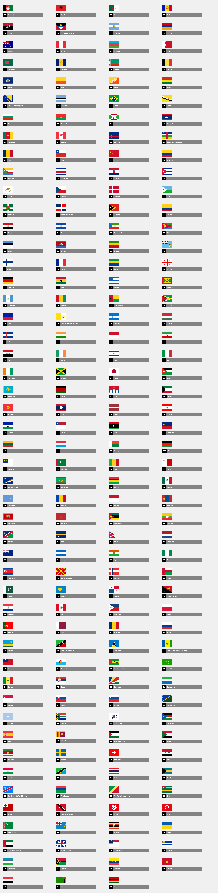

# Collection of 195 country flags
A combination of `CSS`, `font` and `base64` symbols covering all recognised countries.

### Scripts
- `sass:compile`: Compiles SASS code into CSS output
- `storybook:compile`: Compile and serve storybook with flags playground

### Installation
`yarn add @adso-sass/flags`

### Usage
```scss
  $flag-size: 60px;

  @import "~@adso-sass/flags/src/flags";
```

#### Sizes:
Default size: 60px x 40px;

Also available:
- `xs`(scale: 0.33),
- `s`(0.5),
- `m`,
- `l` (1.5), 
- `xl` (2)

#### Helper class

 > `flag flag-${size} flag-${countryCode}`

#### Example
```html
<div class="flag flag-m flag-es"/>
```

### Preview


TODO: 
- Implement territories and dependencies flags
